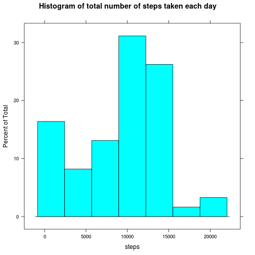
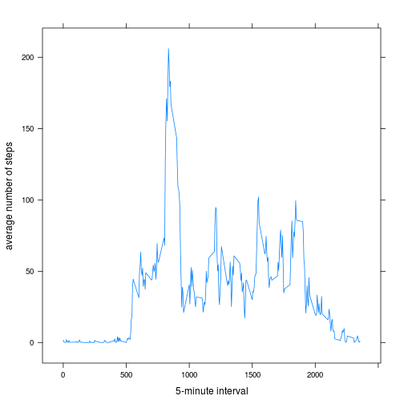
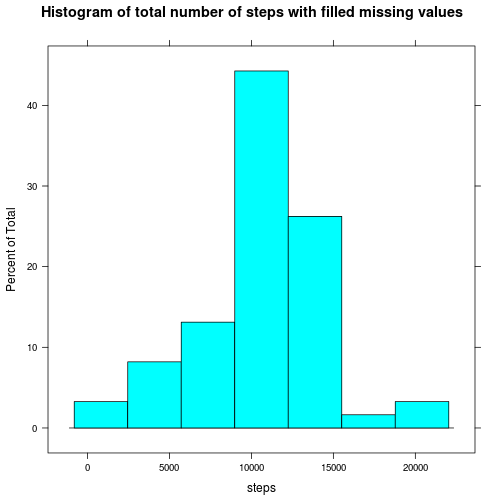
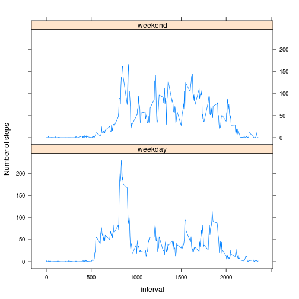

# Reproducible Research: Peer Assessment 1

## Loading and preprocessing the data

```r
library(lattice)
x <- read.csv(unz("activity.zip", "activity.csv"))
x$date <- as.Date(x$date)
```


## What is mean total number of steps taken per day?

```r
## summing steps for each day
perDay <- aggregate(x$steps, list(date = x$date), sum, na.rm = TRUE)
histogram(perDay$x, main = "Histogram of total number of steps taken each day", 
    xlab = "steps")
```

 

#### mean total number of steps taken per day

```r
mean(perDay$x)
```

```
## [1] 9354
```

#### median total number of steps taken per day

```r
median(perDay$x)
```

```
## [1] 10395
```


## What is the average daily activity pattern?

```r
## getting mean of steps for each interval
perInterval <- aggregate(x$steps, list(interval = x$interval), mean, na.rm = TRUE)
xyplot(x ~ interval, data = perInterval, type = "l", xlab = "5-minute interval", 
    ylab = "average number of steps")
```

 

#### 5-minute interval with maximum number of steps

```r
perInterval$interval[which.max(perInterval$x)]
```

```
## [1] 835
```


## Imputing missing values
#### total number of missing values

```r
missing <- is.na(x$steps)
sum(missing)
```

```
## [1] 2304
```


#### filling missing values with mean for the same interval across all days
mean values have been calculated already for perInterval dataset

```r
missingInterval <- x[missing, "interval"]
meanSteps <- sapply(missingInterval, function(z) round(perInterval$x[which(perInterval$interval == 
    z)]))
```


#### creating new dataset with filled in missing values

```r
y <- x
y[missing, "steps"] <- meanSteps
```


#### histogram, mean and median for dataset with filled in missing values

```r
perDayY <- aggregate(y$steps, list(date = y$date), sum)
histogram(perDayY$x, main = "Histogram of total number of steps with filled missing values", 
    xlab = "steps")
```

 

#### mean total number of steps with filled in missing values

```r
mean(perDayY$x)
```

```
## [1] 10766
```

#### median total number of steps with filled in missing values

```r
median(perDayY$x)
```

```
## [1] 10762
```

As we can see, mean total number has increased after filling missing values, median has become closer to the mean value.

## Are there differences in activity patterns between weekdays and weekends?

```r
getDayType <- function(z) {
    d = weekdays(z)
    if (d == "Sunday" || d == "Saturday") 
        "weekend" else "weekday"
}
y$dayType <- factor(sapply(y$date, getDayType))

## getting mean of steps for each interval and each day type
perDayType <- aggregate(y$steps, list(interval = y$interval, dayType = y$dayType), 
    mean)
xyplot(x ~ interval | dayType, data = perDayType, type = "l", ylab = "Number of steps", 
    layout = c(1, 2))
```

 

